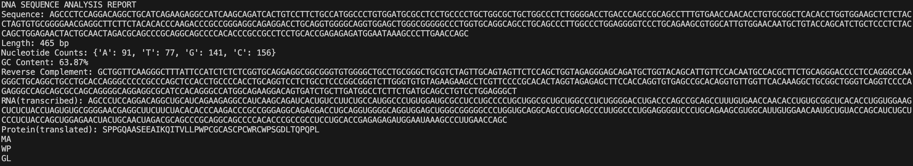

# DNA Sequence Analyzer

A Python command-line tool that analyzes DNA sequences — from basic composition statistics to fetching and processing real genes from NCBI's public database.

## Why I built this

I am student currently in grade 11, and this was my first project combining biology and programming. I wanted to build something that really puts me up to the test,  challenges me and actually mirrors the real DNA → RNA → Protein pipeline (the central dogma of molecular biology) used in real bioinformatics work.

## Features

- **Sequence cleaning & validation** — normalizes input and checks for valid DNA bases (A, T, G, C)
- **Nucleotide counting** — counts occurrences of each base
- **GC content calculation** — a measure of DNA stability, commonly used in molecular biology
- **Reverse complement generation** — models the antiparallel double-strand structure of DNA
- **Transcription** — converts DNA to RNA (T → U)
- **Translation** — converts RNA to a protein sequence using a full 64-codon lookup table, including stop-codon handling
- **Multiple reading frame translation** — translates a sequence starting from all 3 possible reading frames
- **FASTA file parsing** — reads standard-format `.fasta` sequence files, including multi-line sequences
- **Live NCBI integration** — fetches real gene sequences directly from NCBI's GenBank database using Biopython's Entrez module
- **Visualization** — generates a bar chart of nucleotide frequency using matplotlib

## Example output

Running the analyzer on the human insulin gene (NCBI accession `NM_000207`) produces a full report:

   
```
DNA SEQUENCE ANALYSIS REPORT
Sequence: AGCCCTCCAGGACAGGCTGCATCAGAAGAGG...
Length: 465 bp
Nucleotide Counts: {'A': 91, 'T': 77, 'G': 141, 'C': 156}
GC Content: 63.87%
Reverse Complement: GCTGGTTCAAGGGCTTTATTCCATCTCTCTC...
RNA (transcribed): AGCCCUCCAGGACAGGCUGCAUCAGAAGAGG...
Protein (translated): SPPGQAASEEAIKQITVLLPWPCGASCPCWRCWPSGDLTQPQPL
```

## How to run it

**Requirements:**
```
pip3 install biopython matplotlib
```

**Run:**
```
python3 dna_analyzer.py
```

By default, the script fetches the human insulin gene from NCBI, runs the full analysis pipeline, prints translations across all 3 reading frames, and displays a nucleotide frequency chart.

To analyze your own sequence, edit the `if __name__ == "__main__":` block at the bottom of `dna_analyzer.py`, or call any of the functions directly:

```python
analyze("ATGGCCATTGTAATGGGCCGCTGA")
```

## What I learned

This project took me through the full pipeline of real bioinformatics work — not just writing code, but debugging real-world issues like SSL certificate errors when connecting to NCBI, handling incomplete codons at sequence boundaries, and structuring a growing codebase cleanly. It deepened my understanding of both molecular biology fundamentals and practical Python programming.

## Next steps

- 6-frame translation (including the reverse complement strand)
- Support for protein/amino acid sequence input
- A simple web interface
